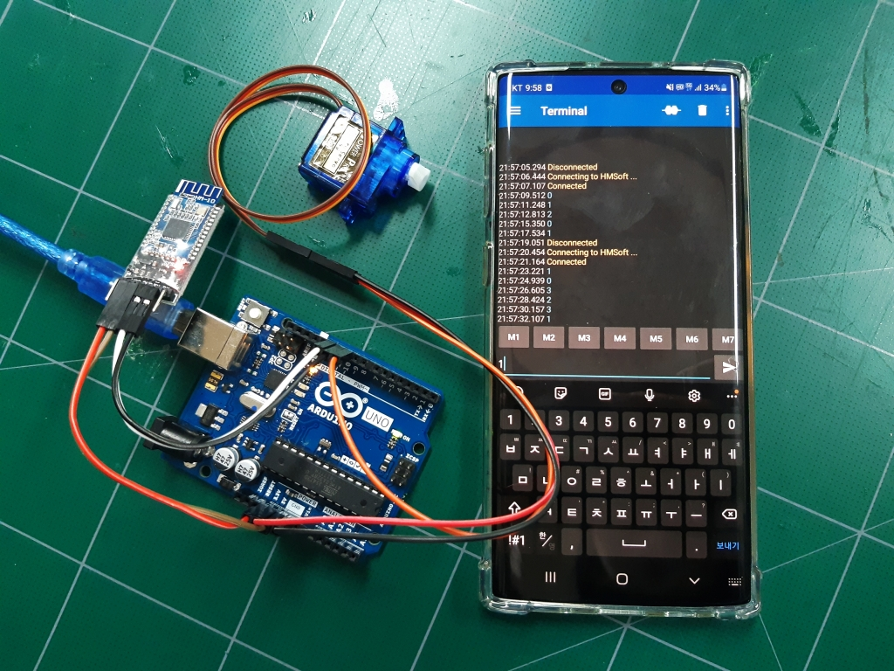

# Project Switch

블루투스 전등 스위치 Project

Pretotype v0.1 (221006)

## File Structure

- [`3D-model/`](3d-model/) : 3D 모델링에 대한 자료를 모아두는 폴더
- [`code/`](code/) : 소스코드를 모아두는 폴더
- [`meeting-minutes/`](meeting-minutes/) : 회의록 모아두는 폴더
- [`resource/`](resource/) : 기타 이미지, 자료들을 모아두는 폴더
- [`abstract.md`](abstract.md) : 전체 구상에 대한 개략적 소개

## 시제품 목록

보다 가성비 있는 제작을 위해 비용 대조 및 디자인 참조를 위한 시제품 목록

[실제 시제품 리스트](https://github.com/siorTeam/project-switch/issues/1)
